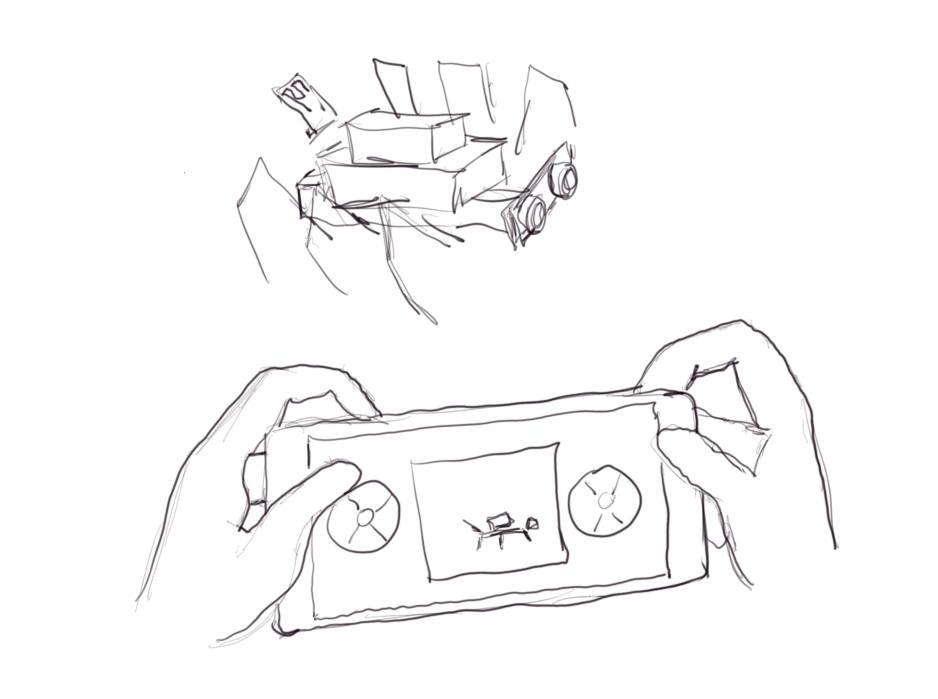
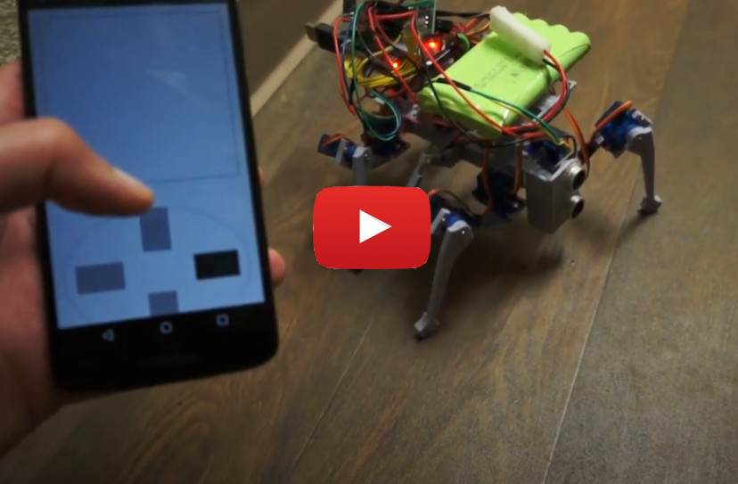
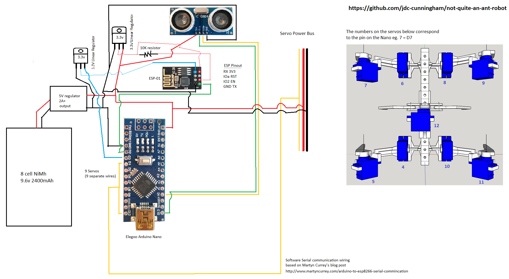

# About
My first legged robot. This was not really designed in terms of using math with regard to torque on servos/current draw/etc... as a result it works best on flat surfaces. The motion of the body is also not great since it can't really lift the legs straight up, rather just swing them out then in an arc to move. At this time I'm still working on the control system by phone, I have an ESP8266-01 and it has a websocket server that my phone connects to, then by serial between the ESP and Arduino I can send commands to run specific gaits to move the robot. At the moment I only have some forward gaits, I am still working on improving/writing better "abstractions" for the code eg. passing in an array of servos/ranges into a function to move the servos at the same time. Right now I just have a bunch of loops as a proof of concept.

This is not intended to be replicated, I mean all the parts are here and I'll provide estimates on print but it's not a good design.

This project has been in progress for at least a week, I don't have a repo history because I published my WiFi SSD credentials in the original private repo.

# Status
Pretty much done/abandoned since the body is too weak and dumb to do anything more. It has a run time I could venture to say up to 2.5 hrs on the specified specs but that's absolutely dry. I did a 30 minute non-stop run and it pulled about 500mAh from the battery. This is at 5.5V at the step down buck converter as I was trying to have the servos use around 4.8V. It seems to perform better here than 6V as it was initially. The next project I'm working on the hybrid sensor pack will weigh at least 6oz and I put an 8oz weight on top of the robot and it could not carry it... so that's why I'm kind of going to abandon this robot as is since it's a disappointment in terms of the build/no brain.

# The vision/concept

# Actual - not quite as I foresaw
### Reasons being:
- too slow to control manually, does not have 4 axis of motion only 2(forward/back, left/right)
- telemetry would have been easy with what I'm doing and the embedded `WebGL` aspect would have been overkill as well as a little animation for the controller. Mostly though changing directions, this robot is too weak/stupid to be useful, I can't leave it alone to map a room without thinking it'll get stuck and burn a servo out.

Later on it turns out that having a controller like this while cool is also not practical as the robot is so slow, I'll still build it but it'll be like a "heading hold" type of control.

I did just throw a thing on top to hold the electronics, ideally the CG would be lower, there is clearance below the body, especially since now it's not intended to work on carpet which mine is a little deep eg. `1/2 in` long threads.

While I did design the legs like this(back set not mirrored), they are actually technically "backwards"/not symmetrical... so it has a forward-cg to compensate.

It has a middle servo pretty much for balance, when it moves forward the middle servo lifts up the middle legs. Anyway with this design as a result I can't do the full tripod-gait, I have some type of modified trypod gait going on. Initially I had a wave-type gait going, where one leg moved at a time but I think that's too slow. It is nuts how much current all the servos pull. I had to use a 2A wall power supply and hardly any of my batteries would work(too heavy/not enough current).

Here the servos are not moving very fast(`10ms delay`) and a 2 second overally delay between the forward motion gait see [here](./robot/code/test/all_servos/all_servos.ino).

## Note: it's not as slow as you see above

The servo speed is just set slow there, [here it is near full speed](https://www.youtube.com/watch?v=y_KfgiUq9XE)

# Parts list

- ($18.69 for 10) 9g servo (x9)
- ($15.98 for 3) Arduino Nano
- ($12.98 for 4) ESP8266-01
- ($9.59 for 5) HC-SR04 ultrasonic sensor
- ($12.99 for 5) 5V buck converter for battery (can use UBEC maybe linear regulator as well)
- ($7.85 for 12) 3.3V linear regulator (x2)
- 10K resitor
- ($17.99) 9.6v 8cell 2400mAh NiMh battery pack
- solderable breadboards
- breadboards
- breadboard wires
- 3D printer/filament
- hot/super glue

## Total Unit cost estimate: $50.00
(not including tools eg. 3D printer($200))

### Note: can also use a 7.2v 2 cell battery
After lowering the voltage the servos operated at, it can run on a 2 cell li-ion, I'm using a 2 cell 2600mAh now. It's much lighter(<3oz vs. 6oz)
That gives some extra weight that could be carried.

# Schematic

# Feature Completion

- [x] physical body
- [x] basic socket to serial communication
- [ ] rest of the gaits
    - [x] backwards
    - [ ] sideways (crab) - attempt called sway in code
        - doesn't really work(need to be on smooth surface)
    - [x] rotate
    - [ ] roll
        - similar to crab walk, again problem of servos being weak
- [x] mobile controller
    - very basic design, spent like 2 hours
- [ ] add IMU (9-axis)
    - not done on this robot, maybe added later assuming light enough
- [x] add ultrasonic sensor on front
    - current code intercepts commands and makes robot turn left if something is within 7" of front

# Print times (0.2mm quality 20% infill)
- 49 mins main servo mount for swivel arms
- 2 hrs 42 mins middle lift legs
- 4 hrs 20 mins top group
- 3 hrs 14 mins test stand
- 1 hr 29 mins outer pitch legs
- 1 hr 26 mins 1 swivel arm
- 1 hr 34 mins main stick with holes

## Update
I would suggest printing the legs(pitch and swivel) thicker as they experience the most stress. This is only really a problem on carpet. I am printing out these foot cups which may help alleviate the stress on the legs but still it may be a good idea to increase that thickness(will need to reslice).

# Software

The parts were designed with Google SketchUp. I used a plugin to export the STL file(as well as a solid part inspector plugin) then used Cura to slice the parts. Take note of parts that need supports, you have to turn that on in Cura. Parts are printed with a Creality Ender 3 Pro.

# Warning

The servo horn spline I have here is bad, they slip. I traced/made my own from a photo I took. I ended up having to use long screws and super glue to try and make them not slip. Also the design is generally bad where the servos are directly holding the load vs. just transfering motion. And overall the design is bad as I mentioned with how it can move. I think you need more servos but it's nuts thinking each leg would have at least 3 servos and a true hexapod would have 18 servos right there.

# Thoughts

Overall it is a fun project, learned a lot. It has a ways to go code wise and will serve as a platform for other work.
