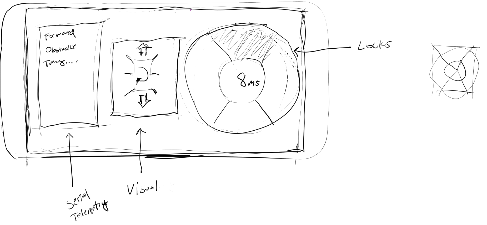
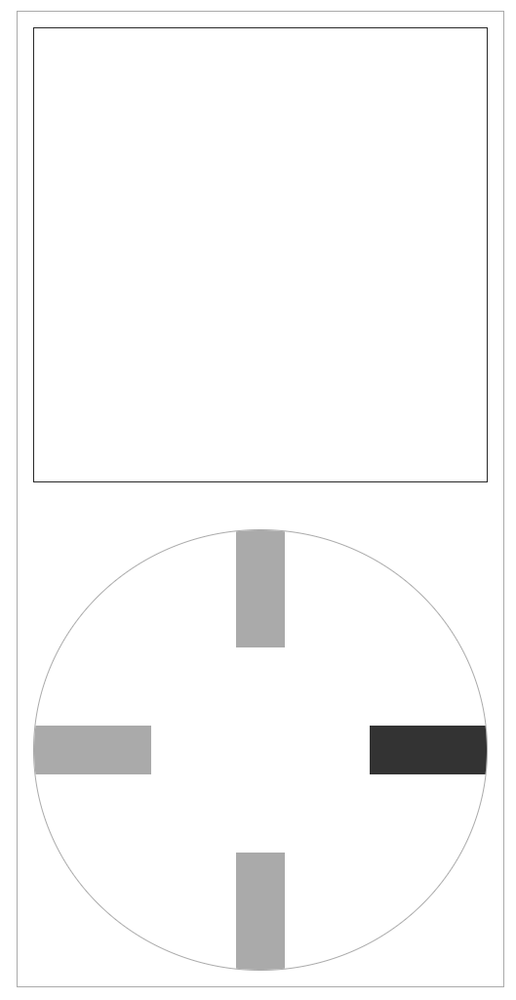

# About the controller
This is a basic controller, I created a different version initially but triangles in html/css are kind of a hack so the last triangle overlaps the rest... problems with clicks. It's not an impossible thing to solve eg. use SVG or background images, etc... but yeah. Also the math since I didn't have something to bind clicks to, this is not just a quadrant it's a diagonal thing going on for the original design below. I ended up just going with a basic `+` style controller. It's also not responsibly styled or anything, I probably spent 2 hrs on this controller so yeah it's trash but it does work. When the robot is turned on __first__ your phone or computer that's looking at the deployed static files of this controller will connect to the robot and steer it. The ultrasonic sensor onboard will interrupt your command and avoid an obstacle if it detects one within 7 inches(roughly half the box the robot takes up/uses to rotate).

Also I have not gotten to the interface/telemetry aspect. It's kind of pointless at this time for this project since I can't leave this project alone(it can get stuck, flip over, etc... strain the servos). For example the center servo got so hot(not sure if it was a dud or not, hasn't happened since) but it got so hot it started to melt the plastic mount(3D printed).

Anyway instead of the above you just have this lol. But yeah some telemetry would be possible by the serial onboard but since it's software serial at `115200` (trash data) you'd probably have to do some enumeration like I did which I don't know how useful that is.

The other aspect that's missing here is a front-end IP scanner because the IP may change if your router re-assigns the device. So you'd have to manually put in existing/known ip's then the mobile controller would scan the possible open ones and try to connect by socket.

# To use
Anyway if anyone actually tries to use this. You'll have to change the IP in the `App.js` to match your ESP's IP that's hosting the websocket server. Then do `npm run build` that'll generate your static files(assumes you have `node/npm/npx` installed haha). I can see how you make "useable code".

This project was bootstrapped with [Create React App](https://github.com/facebook/create-react-app).